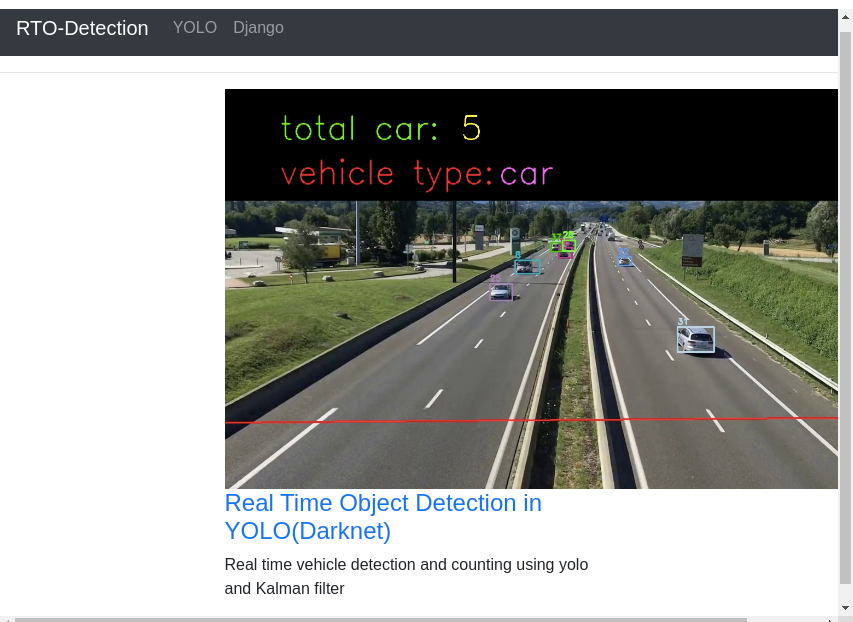

# Implementing Real Time Object Detection and Counting using YOLO and SORT on Django 

 

## I would like to thank
Dr. Adrian Rosebrock of the pyimagesearch organization who implemented yolo (darknet) on PySimpleGUI
(https://www.pyimagesearch.com). and Mr.Bamwani who implemented in python(https://github.com/bamwani/car-counting-and-speed-estimation-yolo-sort-python). I'm interested to implement it on Django web framework.
 

## OS: Ubuntu or other Linux flavor 


## Running the app
1. create a directory of any related name let say myProject
	```
	mkdir myProject
	```	
2. enter a myProject directory and create a virtual environment of any related name let say object_detection
	```
    cd myProject 
	virtualenv object_detection
	```
3. activate the virtual environment
	```
	source object_detection/bin/activate
	```
4. install all the necessary packages in the virtual env from requirement.txt
	```
	pip install requirements.txt
	```

5. download or clone the project in your current directory

6. enter into the project directory that you downloaded
	 
7. download the trained data yolov3.weights(248MB) from https://www.pjreddie.com and put in yolo directory.
8. run the django development server 
	```
	python manage.py runserver
	```

9. type http://127.0.0.1:8000/rto_detection/ in your browser 


## output
```

```

## Learn More

yolo by Joseph Redmon
https://pjreddie.com

simple sort using Kalman Filter
https://arxiv.org/abs/1602.00763

car counting and speed estimation
https://github.com/bamwani/car-counting-and-speed-estimation-yolo-sort-python

Django documentation
https://docs.djangoproject.com

 

